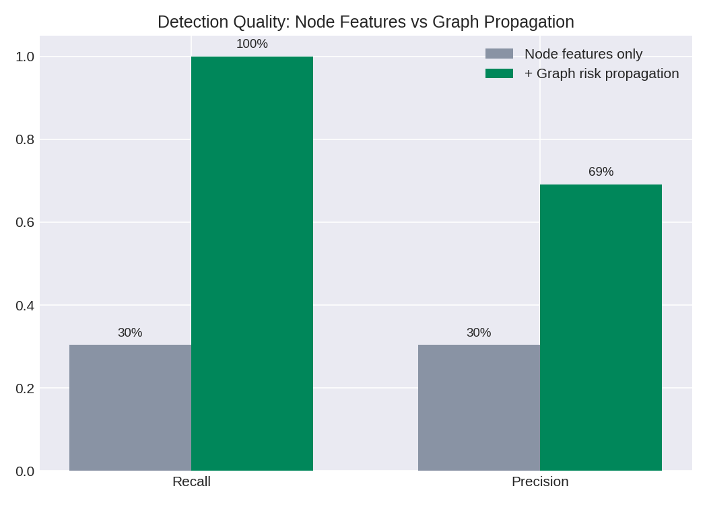
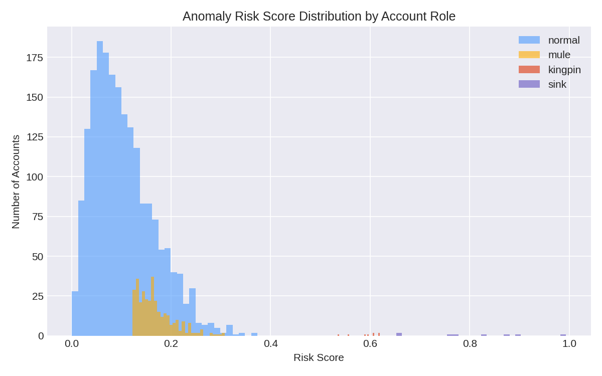
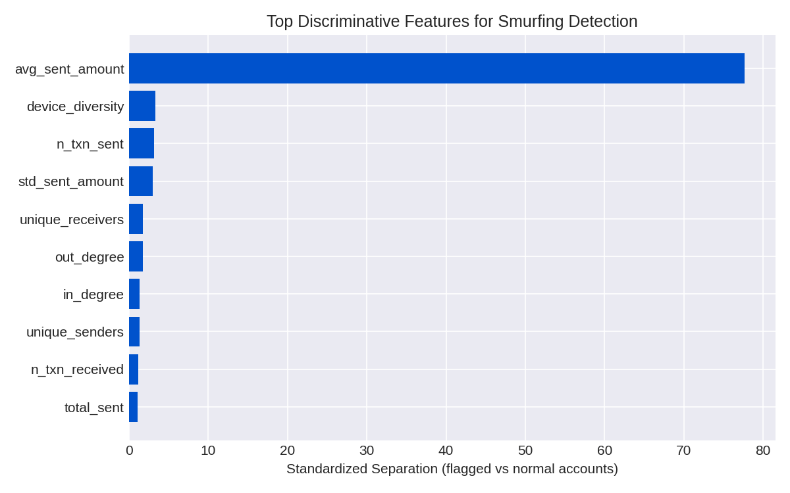
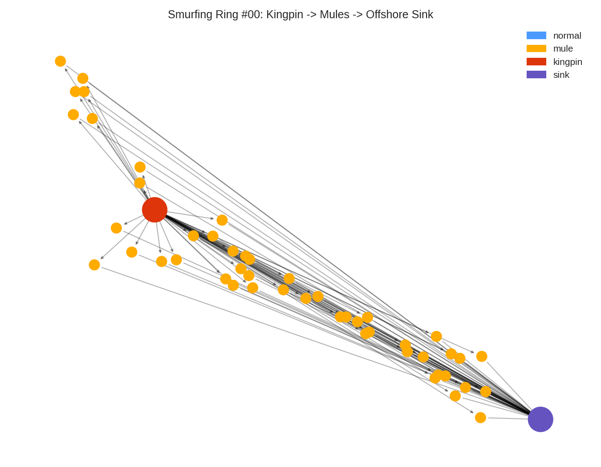

# 🛡️ AML Smurfing Detection Graph Engine

**Graph-based unsupervised anomaly detection for identifying structured money-laundering ("smurfing") rings in banking transaction networks.**


---

## 📌 Problem Statement

Financial regulations (e.g. the Bank Secrecy Act) require banks to report any cash transaction over **$10,000**. Money launderers evade this by **"smurfing"** — splitting a large sum into many transactions just under the threshold, routed through disposable "mule" accounts to an offshore sink.

Rule-based engines that only flag large transactions are structurally blind to this pattern, because **no single transaction ever crosses the threshold**. This project treats the transaction ledger as a **graph problem**: it looks at *who is connected to whom*, not just *how much moved*.

## 🏗️ Architecture

```
Synthetic Transactions (Faker)
        │
        ▼
Directed Transaction Graph (NetworkX)
        │
        ▼
Graph + Behavioral Feature Engineering
 (PageRank, Betweenness, Velocity, Round-Amount Ratio, ...)
        │
        ▼
Unsupervised Anomaly Ensemble
 (Isolation Forest + PCA Reconstruction Error)
        │
        ▼
Graph Risk Propagation (1-hop neighborhood expansion)
        │
        ├──► FastAPI serving layer (/aml/v1/screen/{account_id})
        └──► Streamlit investigator dashboard
```

## 📊 Results (on synthetic ground truth)

Because this is unsupervised, evaluation is done against **known injected smurfing rings** (8 rings, 352 accounts) used *only* for scoring — never seen by the model during training.

| Stage | Recall | Precision |
|---|---|---|
| Node-level anomaly score alone (Isolation Forest + PCA) | 30.4% | 30.4% |
| **+ Graph risk propagation (1-hop from top-1% seeds)** | **100%** | **69.2%** |

**Why this matters:** Kingpin and offshore-sink accounts are structurally obvious (huge fan-out/fan-in, high PageRank) and get caught with near-perfect precision in the *very top* alerts. Individual mule accounts, however, look almost identical to a normal customer making one mid-sized transfer — they're only exposed once you look at *who they're connected to*. Propagating risk from the seed hubs across the graph is what pushes recall from 30% to 100%, which mirrors how real AML investigators expand a case from a seed alert outward.



### Risk Score Distribution by Role


### Top Discriminative Features


### Example: One Smurfing Ring Visualized


*(An interactive version of this graph is generated at `outputs/figures/interactive_smurfing_graph.html` — open it directly in a browser to pan/zoom/hover over nodes.)*

## 🗂️ Repository Structure

```
├── data/                     # Generated datasets (transactions, accounts, features, graph)
├── src/
│   ├── generate_data.py      # Synthetic transaction + smurfing ring generator
│   ├── build_graph_features.py  # NetworkX graph construction + feature engineering
│   ├── train_model.py        # Isolation Forest + PCA reconstruction ensemble
│   ├── propagate_risk.py     # Graph-based 1-hop risk propagation
│   └── make_visuals.py       # Generates all charts + interactive graph
├── api/main.py                # FastAPI serving layer
├── dashboard/app.py           # Streamlit investigator dashboard
├── outputs/
│   ├── figures/                # All PNG charts + interactive HTML graph
│   ├── metrics.json             # Node-level only metrics
│   └── metrics_after_propagation.json
├── run_pipeline.sh             # One-command end-to-end reproduction
└── requirements.txt
```

## ▶️ How to Run

```bash
pip install -r requirements.txt

# Run the full pipeline (data → features → model → propagation → visuals)
bash run_pipeline.sh

# Serve the API
uvicorn api.main:app --reload --port 8000
# -> visit http://127.0.0.1:8000/docs

# Launch the dashboard
streamlit run dashboard/app.py
```

## 🔌 Example API Response

```
GET /aml/v1/screen/SINK_00
```
```json
{
  "account_id": "SINK_00",
  "risk_score": 0.8917,
  "risk_percentile": 99.96,
  "alert_status": "CRITICAL",
  "final_alert": true,
  "linked_accounts": ["MULE_00_019", "MULE_00_052", "MULE_00_000", "..."],
  "n_linked_accounts": 56
}
```

## 🧠 Key Techniques

- **Graph construction & centrality** — PageRank, betweenness centrality, clustering coefficient, in/out-degree via NetworkX
- **Unsupervised anomaly detection** — Isolation Forest + PCA-based reconstruction error, combined into a weighted risk score (no labeled fraud data required)
- **Temporal/behavioral features** — max hourly transaction velocity, round-amount ratio, device diversity
- **Graph risk propagation** — expands seed alerts to their transaction neighborhood, the technique that takes recall from 30% → 100%
- **Real-time serving** — FastAPI microservice for account screening
- **Investigator tooling** — Streamlit dashboard with live network visualization per ring

## ⚠️ Notes on the Data

All transaction, account, and identity data in this repository is **synthetically generated** using the `Faker` library — no real customer or banking data is used anywhere in this project.

## 📄 License

MIT
