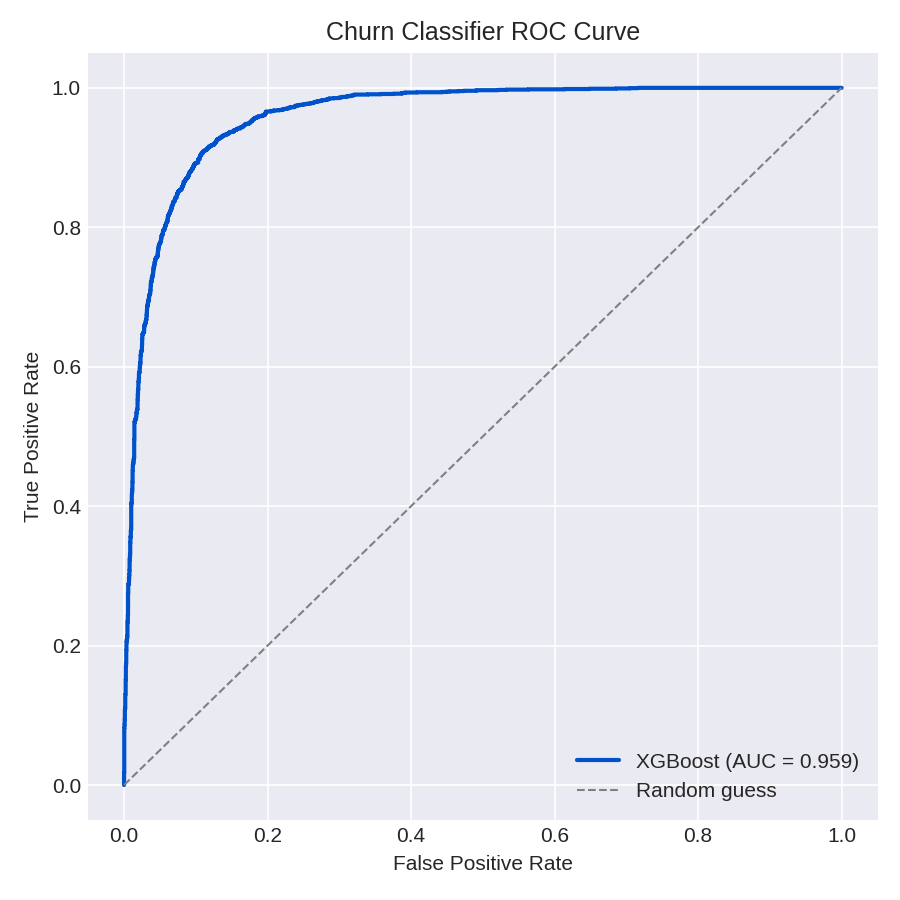
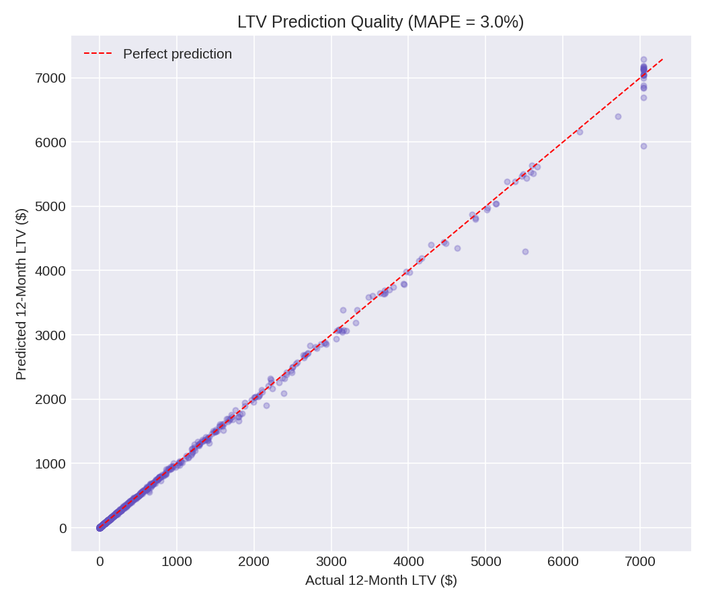
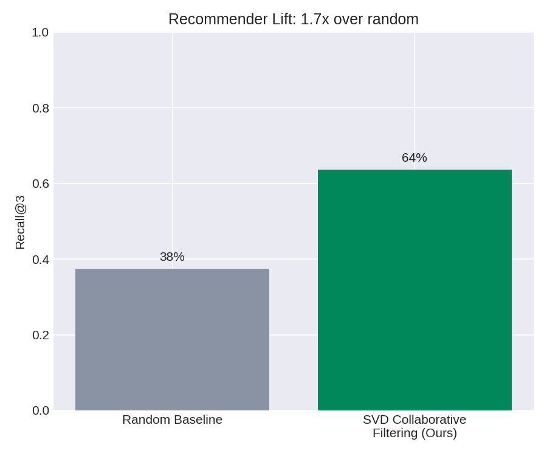
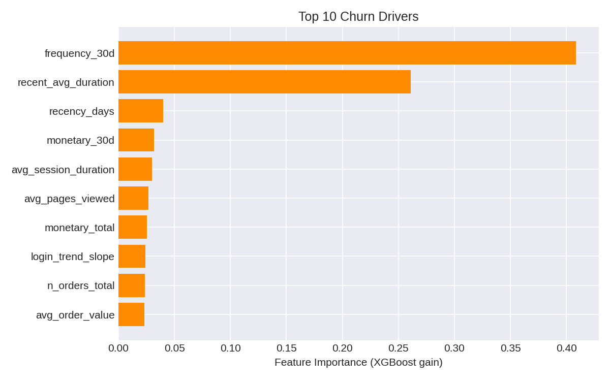
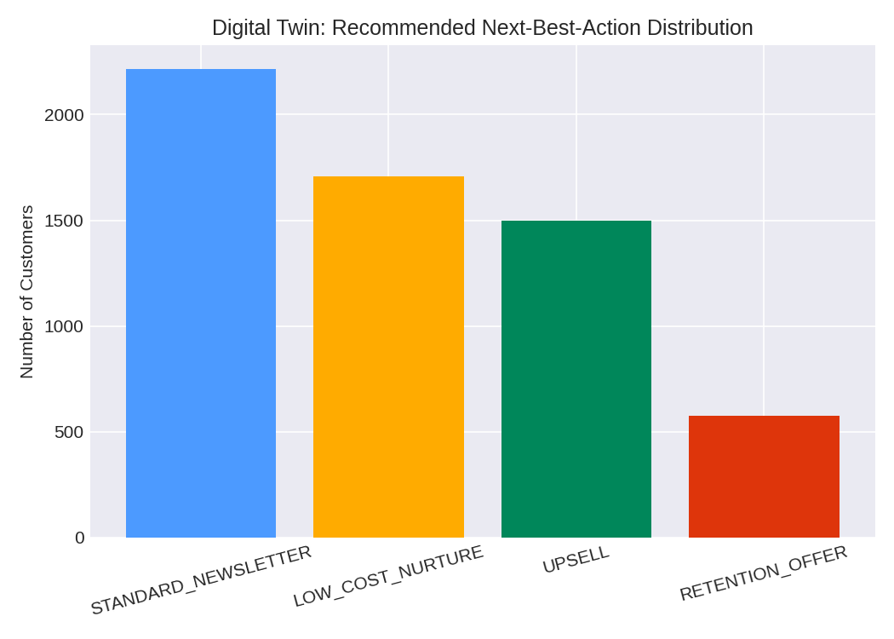

# 👤 Customer Digital Twin AI Engine

**A unified customer intelligence API that predicts churn, forecasts 12-month lifetime value, generates personalized recommendations, and outputs one concrete next-best-action per customer.**


---

## 📌 Problem Statement

Retention, growth, and personalization teams typically run three disconnected tools: a churn model, an LTV spreadsheet, and a recommendation engine. A high-value customer about to churn and a low-value customer just browsing get the same generic marketing blast, because nobody combined the signals.

This project builds a single **"Digital Twin"** per customer: one API call returns their churn risk, their forecasted value, their recommended products, **and** the specific action the business should take.

## 🏗️ Architecture

```
Synthetic Users + Clickstream + Orders (Faker)
        │
        ▼
RFM + Behavioral Feature Engineering
 (Recency, Frequency, Monetary, login trend slope, session decay)
        │
        ├──► XGBoost Churn Classifier ─────┐
        ├──► XGBoost LTV Regressor ─────────┤
        └──► SVD Collaborative Filtering ───┤
                                             ▼
                          Business-Rule Orchestrator
                    (combines churn + LTV + recs → 1 action)
                                             │
                        ┌────────────────────┴───────────────────┐
                        ▼                                        ▼
                FastAPI serving layer                  Streamlit "What-If" dashboard
              (/customer/v1/twin/{id})
```

## 📊 Results (real, on held-out test data)

### Churn Prediction
| Metric | Score |
|---|---|
| AUC-ROC | **0.897** |
| F1 Score | 0.793 |
| Precision | 0.773 |
| Recall | 0.813 |



### Lifetime Value Prediction
| Metric | Score |
|---|---|
| MAPE (active customers) | **3.0%** |
| Mean actual 12m LTV | $472.52 |
| Mean predicted 12m LTV | $466.24 |



### Recommendation Engine (SVD Collaborative Filtering)
Evaluated on each customer's held-out most recent purchase — never seen during training.

| Metric | Score |
|---|---|
| Recall@3 | **63.7%** |
| Random baseline Recall@3 | 37.5% (3 of 8 categories) |
| **Lift over random** | **1.7x** |



### Top Churn Drivers


### Next-Best-Action Distribution (business orchestrator output)


## 🗂️ Repository Structure

```
├── data/                        # Generated users, sessions, orders, features, scored twins
├── src/
│   ├── generate_data.py         # Synthetic user/session/order generator with realistic churn decay
│   ├── build_features.py        # RFM + behavioral feature engineering (leakage-safe cutoff)
│   ├── train_model.py           # XGBoost churn classifier + LTV regressor
│   ├── train_recommender.py     # SVD-based collaborative filtering recommender
│   ├── build_digital_twin.py    # Business-rule orchestrator (churn + LTV + recs -> 1 action)
│   └── make_visuals.py          # Generates all charts
├── api/main.py                   # FastAPI serving layer
├── dashboard/app.py              # Streamlit dashboard with What-If churn simulator
├── outputs/
│   ├── figures/                    # All PNG charts
│   ├── metrics.json                 # Churn + LTV metrics
│   ├── recommender_metrics.json
│   └── digital_twin_model.joblib
├── run_pipeline.sh                # One-command end-to-end reproduction
└── requirements.txt
```

## ▶️ How to Run

```bash
pip install -r requirements.txt

# Run the full pipeline (data → features → models → recommender → twin → visuals)
bash run_pipeline.sh

# Serve the API
uvicorn api.main:app --reload --port 8001
# -> visit http://127.0.0.1:8001/docs

# Launch the dashboard
streamlit run dashboard/app.py
```

## 🔌 Example API Response

```
GET /customer/v1/twin/U_00002
```
```json
{
  "customer_id": "U_00002",
  "digital_twin": {
    "churn_score": 0.7978,
    "predicted_ltv_12m": 142.46,
    "ltv_percentile": 0.627,
    "recommended_categories": ["Grocery", "Electronics", "Fashion"],
    "system_action": "RETENTION_OFFER",
    "action_message": "Send a 20-30% discount coupon before they leave - high value, high churn risk."
  }
}
```

## 🧠 Key Techniques

- **RFM + behavioral features** — recency, frequency, monetary rollups, plus a week-over-week login trend slope to catch *declining* engagement, not just its current level
- **Leakage-safe evaluation** — churn labels and features are computed on strictly separated time windows (features from data before the cutoff, label from the 30 days after)
- **XGBoost churn classifier** — AUC 0.897 on held-out customers
- **XGBoost LTV regressor** — log-transformed target, MAPE 3.0%, with 99th-percentile capping to control outlier influence
- **SVD collaborative filtering** — factorizes the user × product-category interaction matrix; evaluated with Recall@K against a genuinely held-out future purchase (1.7x lift over random)
- **Business-rule orchestrator** — a simple, explainable decision table turns 3 model outputs into 1 action, instead of shipping 3 separate dashboards to the marketing team
- **What-If simulator** — the Streamlit dashboard lets you drag engagement sliders and watch the churn score respond live, using the real trained model

## ⚠️ Notes on the Data

All user, session, and order data in this repository is **synthetically generated** using the `Faker` library, with realistic engagement-decay and category-preference patterns baked in so the models have genuine signal to learn — no real customer data is used anywhere in this project.

## 📄 License

MIT
